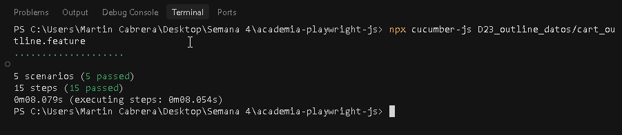
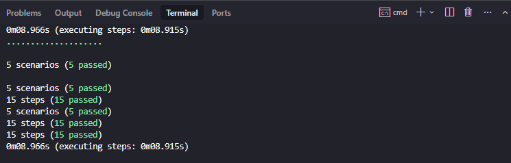

Noelia Mustaff | Martín Cabrera

# D23 - Scenario Outline y datos (Carrito de compras)
 
# Descripción
 
En este ejercicio se implementó una feature data-driven utilizando Scenario Outline.
El objetivo fue validar que distintos productos puedan agregarse correctamente al carrito en SauceDemo, verificando tanto el nombre como el precio.
 
---
 
## Ejecución
 
Para correr la feature:
 
npx cucumber-js --require ./D23_outline_datos/world.js --require ./D23_outline_datos/cart.steps.js ./D23_outline_datos/cart_outline.feature
 
Resultado esperado:
 
5 scenarios (5 passed)
15 steps (15 passed)
 
---
 
# Decisiones de implementación
 
# Uso de Scenario Outline
 
Se utilizó Scenario Outline para:
 
* evitar duplicación de escenarios
* ejecutar el mismo flujo con distintos datos
* mantener el código más limpio y escalable
 
---
 
# Selectores utilizados
 
Se priorizaron selectores robustos:
 
* `getByRole()` para botones (ej: Login)
* `getByPlaceholder()` para inputs
* `locator().filter({ has: ... })` para ubicar productos dinámicamente
 
Ejemplo:
 

const item = this.page.locator('.inventory_item').filter({
  has: this.page.getByText(producto),
});

---

# Validaciones (Assertions)
 
Se implementaron validaciones claras:
 
* Verificar login exitoso mediante URL (`/inventory.html`)
* Verificar navegación al carrito (`/cart.html`)
* Validar que el producto esté visible
* Validar que el precio coincida con el esperado
 
---
 
# Uso de World (Contexto compartido)
 
Se utilizó un World personalizado para compartir el estado entre steps:
 
* browser
* context
* page
 
---
 
# Conclusión
 
Se logró implementar una solución data-driven utilizando buenas prácticas:
 
* reutilización de steps
* selectores robustos
* separación clara entre feature y código
* uso de contexto compartido

---

| Terminal - ejecución (Martin) | Terminal - ejecución (Noe) |
|---|---|
|  |  |
---